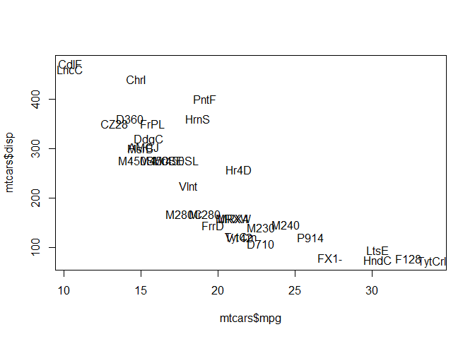

Study Guide - Final
================
Joren Moreno
May 4, 2018

``` r
knitr::opts_chunk$set(echo = TRUE, error = TRUE, comment = "", eval = TRUE)
```

[Stat133-GastonSanchez-Syllabus](https://github.com/ucb-stat133/stat133-spring-2018/tree/master/syllabus)

### Rmd files

**Rmd** files are a special type of file, referred to as a *dynamic document*. It combines both the commands and the narrative of R code.

The structure of an `.Rmd` file can be divided in two parts: 1) a **YAML header**, and 2) the **body** of the document.

1.  *YAML header* consists of the first few lines at the top of the file. This header is established by a set of three dashes --- as delimiters (one starting set, and one ending set). This part of the file requires you to use YAML syntax (Yet Another Markup Language.) Within the delimiter sets of dashes, you specify settings (or metadata) that will apply to the entire document. Some of the common options are things like:

-   `title`
-   `author`
-   `date`
-   `output`

1.  The *body* of the document is everything below the YAML header. It consists of a mix of narrative and R code. All the text that is narrative is written in a markup syntax called **Markdown** (although you can also use LaTeX math notation). In turn, all the text that is code is written in R syntax inside *blocks of code.*

-   The header uses YAML syntax
-   The narrative in the body uses Markdown syntax.
-   The code and commands use R syntax.

### Markdown tutorial

-   *Italics* (italics)
-   **Bold** (bold)
-   Paragraphs:
    -   use two blank spaces at the end of the line or
    -   this is a line break
-   Headings: a hash `#` and a space makes a header. The more `#`, the smaller the header.

> Blockquotes: To create a blockquote, start a line with greater than `>` followed by an optional space. Blockquotes can be nested and can also contain other formatting. end of blockquote

-   Lists:
    -   unordered lists use asteriks `+`, or `-` as list markers
    -   ordered lists use numbers followed by a period `.` or right paren `)`
-   Links:
    -   links can either inline with the text, or placed at the bottom of the text as references. Link text is enclosed by square brackets `[]`, and for inline links, the link URL is enclosed by parens `()`.
-   Images:
    -   images are almost identical to links, but an image starts with an exclamation point `!`.
-   Code:
    -   `code`

    <!-- -->

        or use 3 backticks

-   Nested Lists
    -   Item
        1.  First subitem
        2.  Second subitem

### Data Types in R

-   Integer (whole numbers)
-   Double (real, decimal numbers)
-   Logical (boolean)
-   Character (strings)
-   Numeric (integer/real/double numbers)

### Coercion

If you mix different data values, R will **implicity coerce** them so they are ALL of the same type

``` r
#example 
a <- c(1,2,3,"four","five")
b <- c(TRUE,FALSE,3,4)
```

R provides a set of **explicit** coercion functions that allow you to "convert" one type of data into another:

-   as.character()
-   as.numeric()
-   as.integer()
-   as.logical()

### How does R coerce data types in vectors?

R follows two basic rules of implicit coercion

1.  If a character is present, R will coerce everything else to characters.
2.  If a vector contains logicals and numbers, R will convert the logicals to numbers (TRUE to 1, FALSE to 0)

Here is the general rule:

-   logical &lt; integer &lt; numeric &lt; complex &lt; character

### Special data values in R

-   `Null` = null object
-   `NA` = Not Available (missing value)
-   `Inf` = positive infinite
-   `-Inf` = negative infinite
-   `NaN` = Not a Number (different from NA)

### Subsetting

#### Numeric subsetting

``` r
x <- c(2,4,6,8)

# first 3 elements
x[1:3]
```

    [1] 2 4 6

``` r
# non-consecutive elements
x[c(1,3)]
```

    [1] 2 6

``` r
# different order
x[c(3,2,4,1)]
```

    [1] 6 4 8 2

**Logical subsetting** occurs when the vector of indices that you pass inside the brackets is a logical vector.

``` r
x <- c(2,4,6,8)
names(x) <- letters[1:4]
      
# first element
x[c(TRUE,FALSE,FALSE,FALSE)]
```

    a 
    2 

``` r
# elements equal to 2
x[x == 2]
```

    a 
    2 

``` r
# elements different to 2
x[x != 2]
```

    b c d 
    4 6 8 

``` r
# all elements
x[TRUE]
```

    a b c d 
    2 4 6 8 

``` r
# convert numbers as logicals 
x[as.logical(c(0,1,pi,-10))]
```

    b c d 
    4 6 8 

**Character subsetting** occurs with characters

``` r
# element names "a"
x["a"]
```

    a 
    2 

``` r
# "b" and "d"
x[c("b","d")]
```

    b d 
    4 8 

``` r
# "a" 5 times
x[rep("a",5)]
```

    a a a a a 
    2 2 2 2 2 

### Indexing

*Bracket notation for vectors*

-   To extract values from R object use brackets: \[\]
-   Inside the brackets specify vector(s) of indices
-   Use as many indices, separated by commas, as dimensions in the object
-   Vector(s) of indices can be *numbers, logicals*, and sometimes *characters*
-   df\[i,j\]: i is the row index, j is the column index

``` r
# example
list <-  list(
  c(1,2,3),
  matrix(1:9, nrow = 3, ncol = 3),
  list(1:2, c(TRUE,FALSE), c("a","b"))
) 
```

##### access list elements

``` r
# list[elem]

list[1]
```

    [[1]]
    [1] 1 2 3

##### access object of list element

``` r
# list[[elem]]

list[[1]]
```

    [1] 1 2 3

##### access object's elemets, of list element

``` r
# list[[elem]][obj]

list[[1]][2]
```

    [1] 2

``` r
list[[2]][1,1]
```

    [1] 1

``` r
list[[2]][,2]
```

    [1] 4 5 6

##### access object's elements, of list element

``` r
# list[[elem]][[obj]]

list[[3]][[1]]
```

    [1] 1 2

##### access element of object's elements, of list element

``` r
# list[[elem]][[obj]][ind]
  
list[[3]][[1]][1]
```

    [1] 1

``` r
list[[3]][[3]][c(1,2)]
```

    [1] "a" "b"

#### Dollar notation

##### access list named elements

``` r
lst <- list(
  vec = c(1,2,3),
  mat = matrix(1:9, nrow = 3, ncol = 3),
  lis = list(1:2, c(TRUE,FALSE), c("a","b"))
)

lst$vec
```

    [1] 1 2 3

##### access list named elements

``` r
lst$vec[2]
```

    [1] 2

``` r
lst$lis[[1]]
```

    [1] 1 2

### Recycling Rule & Vectorization

#### Recycling Example

``` r
x <- c(2,4,6,7)
x + 3
```

    [1]  5  7  9 10

-   Most functions that operate with vectors in R are vectorized functions. This means that an action is applied to all elements of the vector without the need to explicitly type commands to traverse all the elements.

### Object Names

There are certain rules you have to follow when creating objects and variables. Object names cannot start with a digit and cannot contain certain other characters such as a comma or a space. You will be wise to adopt a convention for demarcating words in names.

### Factors

Vectors, matrices, and arrays are atomic structures (they can only store one type of data)

-   A factor is a data structure designed to handle **categorical data**.
-   Use factor().
-   Factors are **internally stored as vectors of integers**.
-   Factors generally convert strings or characters, (i.e. "yes" to yes)
-   Under the hood, a factor is internally stored using two arrays (R vectors): one is an integer array containing the values of the categories, the other array is the "levels" which has the names of categories which are mapped to the integers.
-   `table()` is a function to get a table with the frequencies (i.e. counts) of the factor categories or *levels*
-   use `as.factor()` to force a vector to have a factor data structure

### Lists

-   A list is the most general data structure in r
-   Lists can contain any other type of data structure
-   Lists can even contain other lists
-   Lists are a special type of vector
-   Lists are vectors in the sense of being a one-dimensional object.
-   Lists are NOT atomic structures.

### Inspecting the data objects

-   `typeof()` type of storage of any object
-   `class()` gives you the class of the object
-   `str()` displays the structure of an object in a compact way
-   `mode()` gives the data type (as used in R)
-   `object.size()` gives an estimate of the memory space used by an object
-   `length()` gives the length (i.e. number of elements)
-   `head()` take a peek at the first elements
-   `tail()` take a peek at the last elements
-   `summary()` shows a summary of a given object

### R data frames

-   R data frames are special kinds of lists
-   Stored in R as a list of vectors (or factors)
-   Columns are typically atomic structures.
-   But since a data frame is a list, you can mix different types of columns.
-   Data frames are NOT matrices but they behave a lot like matrices

#### Retrieving data frame information: bracket notation

##### retrieving cells

``` r
df <- airquality

# a single cell
df[2,2]
```

    [1] 118

``` r
# various adjacent cells (permuted order)
df[5:1,6:4]
```

      Day Month Temp
    5   5     5   56
    4   4     5   62
    3   3     5   74
    2   2     5   72
    1   1     5   67

``` r
# non-adjacent cells
df[c(1,50,100), c(3,5)]
```

        Wind Month
    1    7.4     5
    50  11.5     6
    100 10.3     8

##### retrieving cells (excluding indices)

``` r
# various adjacent cells
head(df[-(1:5),-(4:6)])
```

       Ozone Solar.R Wind
    6     28      NA 14.9
    7     23     299  8.6
    8     19      99 13.8
    9      8      19 20.1
    10    NA     194  8.6
    11     7      NA  6.9

``` r
# non-adjacent cells
head(df[-c(1,50,100), -c(3,5)])
```

      Ozone Solar.R Temp Day
    2    36     118   72   2
    3    12     149   74   3
    4    18     313   62   4
    5    NA      NA   56   5
    6    28      NA   66   6
    7    23     299   65   7

##### retrieving rows or columns

``` r
# rows
head(df[1,])
```

      Ozone Solar.R Wind Temp Month Day
    1    41     190  7.4   67     5   1

``` r
head(df[c(2,4,6),])
```

      Ozone Solar.R Wind Temp Month Day
    2    36     118  8.0   72     5   2
    4    18     313 11.5   62     5   4
    6    28      NA 14.9   66     5   6

``` r
# columns
head(df[,1])
```

    [1] 41 36 12 18 NA 28

``` r
head(df[,1:3])
```

      Ozone Solar.R Wind
    1    41     190  7.4
    2    36     118  8.0
    3    12     149 12.6
    4    18     313 11.5
    5    NA      NA 14.3
    6    28      NA 14.9

``` r
# excluding indices: rows
head(df[-1,])
```

      Ozone Solar.R Wind Temp Month Day
    2    36     118  8.0   72     5   2
    3    12     149 12.6   74     5   3
    4    18     313 11.5   62     5   4
    5    NA      NA 14.3   56     5   5
    6    28      NA 14.9   66     5   6
    7    23     299  8.6   65     5   7

``` r
# excluding indices: columns
head(df[,-1])
```

      Solar.R Wind Temp Month Day
    1     190  7.4   67     5   1
    2     118  8.0   72     5   2
    3     149 12.6   74     5   3
    4     313 11.5   62     5   4
    5      NA 14.3   56     5   5
    6      NA 14.9   66     5   6

``` r
# using column name Ozone

head(df[,"Ozone"])
```

    [1] 41 36 12 18 NA 28

``` r
# using column name wind and temp
head(df[,c("Wind","Temp")])
```

      Wind Temp
    1  7.4   67
    2  8.0   72
    3 12.6   74
    4 11.5   62
    5 14.3   56
    6 14.9   66

###### retrieving rows (logical indexing)

``` r
# records with Month 5
head(df[df$Month ==5,])
```

      Ozone Solar.R Wind Temp Month Day
    1    41     190  7.4   67     5   1
    2    36     118  8.0   72     5   2
    3    12     149 12.6   74     5   3
    4    18     313 11.5   62     5   4
    5    NA      NA 14.3   56     5   5
    6    28      NA 14.9   66     5   6

``` r
# vector matching odd numbers
odds <- rep(c(TRUE,FALSE))
length <- nrow(df)

# even rows (logical negation)
head(df[-odds,])
```

      Ozone Solar.R Wind Temp Month Day
    2    36     118  8.0   72     5   2
    3    12     149 12.6   74     5   3
    4    18     313 11.5   62     5   4
    5    NA      NA 14.3   56     5   5
    6    28      NA 14.9   66     5   6
    7    23     299  8.6   65     5   7

``` r
# columns: look for these names
these <- c("Day","Wind","Rain","Temp","XY","Snow")

# query logical selection
Q <- names(df) %in% these 

# selecting corresponding columns
head(df[,Q])
```

      Wind Temp Day
    1  7.4   67   1
    2  8.0   72   2
    3 12.6   74   3
    4 11.5   62   4
    5 14.3   56   5
    6 14.9   66   6

#### Retrieving data frame information: dollar notation (columns)

``` r
# column Ozone
head(df$Ozone)
```

    [1] 41 36 12 18 NA 28

### Functions to inspect data frames

-   `str()`: structure
-   `head()`: first rows
-   `tail()`: last rows
-   `summary()`: descriptive statistics
-   `dim()`: dimensions (\# rows, \# columns)
-   `nrow()`: number of rows
-   `ncol()`: number of columns
-   `names()`: column names
-   `colnames()`: column names
-   `rownames()`: row names
-   `dimnames()`: list with row and column names

### Functions to import tables

-   **read.table()**
-   **read.delim()**
-   **read.csv(), read.csv2()**
-   **read.fwf()**

#### Strings and Factors

By default, strings are converted to factors when loading data frames.

This is the wrong default.

Use `stringsAsFactors = FALSE`

You should always explicitly convert strings into factors later

### dplyr functions

-   `filter`: filter by some specific value.
-   `select`: select certain columns
-   `slice`: select certain rows
-   `group_by`: sort rows by a column name
-   `summarise`: reduce variables to values
-   `aggregate`: aggregate info
-   `arrange`: reorder rows; use `desc()` to obtain descending order
-   `mutate`: add new variables

#### pipelines `%>%` (dplyr & ggplot)

-   Pipelines make multiple dplyr operations easier to read
-   ex: x %&gt;% f(y) turns into f(x,y) so that you can pass outputs as inputs from left-to-right.
-   You can mix the `%>%` operator to chain dplyr commands with ggplot commands (and other R commands)

### ggplot functions (data frames only)

-   `ggplot()` initializes a "ggplot" object; You specify the data set (data frame) with data
-   geoms are geometric objects
    -   `geom_point()` indicates the type of geometric object
    -   `geom_bar()`, `geom_point()`
-   `aes()` maps aesthetic attributes to variables
    -   shape, transparency(alpha), color, fill, linetype
-   faceting
-   themes
-   smoothers
-   scales defines how your data will be plotted
-   saving
    -   `ggsave(object,file = "path/to/figure/filename.png")`

### gitbash commands

-   `wc`: count lines, words, and bytes
-   `wc -l`: count number of lines
-   `head -n 10`: inspect first 10 rows
-   `tail -n 10`: inspect last 10 rows
-   `less`: see contents with a paginator
-   `cut`: select columns
    -   `d`: field delimiter
    -   `f`: column numbers
    -   `c`: characters
-   `pwd`: print working directory
-   `cd`: change directory (move to another directly)
-   `mv`: rename file(s)
-   `cp`: copy file(s)
-   `touch`: create a new (empty) file
-   `rm`: delete file(s)
-   `mkdir`: create a new directory
-   `ls`: list files and directories
-   `curl -O`: download files
-   `cat`: output the contents of a file
-   `grep`: output all occurrences of "text" inside a file
-   `sort`: sort lines of data
    -   `-r`: reverse order
    -   `-u`: unique values
    -   `-n`: numerical order
    -   `-d`: dictionary order (alphabetical)
    -   `-t`: use commas for delimiters
    -   `-k`: sort lines based on a specific column
-   `uniq`:
    -   `-c`: frequencies of the unique values
-   `|`: the bash shell equivalent to the `%>%` command in dplyr
-   `>`: redirects output to a file
-   `>>`: append a file with new information

#### gitbash command examples

    # select third column (-f 3) specifying field-delimiter (-d ",")
    cut -d "," -f 3 datafile.csv

    # redirect above code output to a new file and display it
    cut -d "," -f 3 datafile.csv > newdatafile.txt

    cat newdatafile.txt

    # sort unique occurences

    sort -u newdatafile.txt

    # get unique frequencies

    sort newdatafile.txt | uniq -c

    # one pipeline of unique position frequencies

    cut -d "," -f 3 datafile.csv | tail +2 | sort | uniq -c

### Main Unix Concepts

-   At any given time we are inside a directory.
-   The current directory is the working directory
-   When a new R session is started, a working directory will be associated to the session.
-   When a terminal is started the working directory is the home directory.

#### Paths

-   Each file and directory has a unique name in the filesystem called a path.
-   Absolute Paths: an absolute pathname begins with the root directory and follows the tree branch by branch.
-   Relative Paths: a relative pathname begins at some working directory, moving either up or down the tree.

#### Creating files

3 main ways to create files:

-   Using a text editor
-   Direct output (from command) to a file
-   Using the command `touch`

Note: text editor =/ word processor

#### Spreadsheet inconveniences

-   Excel files (.xls) are NOT text files
-   They are enriched files with added format elements.
-   Cannot be opened with a text editior.
-   You depend on proprietary software.

#### Character Delimited Text

-   A common way to store data in tabular form is via text files.
-   To store the data we need a way to separate data values
-   Each line represents a "row"
-   The idea of columns is conveyed with delimiters.

#### Plain Text Formats

-   There are 2 main subtypes of plain text format, depending on how the separated values are identified in a row.

1.  Delimited formats
2.  Fixed-width formats

#### Advantages

-   Simplicity
-   Common formats (csv,tsv,txt,dat,etc...)
-   Can be opened and modified with a text editor.
-   Can also be opened in spreadsheet software.
-   Easy to understand for most users.
-   Can be read in data analysis software.

### Functions

#### Function anatomy

    some_name <- function(arguments) {
      body
    }

#### Documenting Functions

-   Roxygen comments

``` r
#' @title
#' @description what the function does
#' @param the inputs or arguments
#' @return what is the output
```

#### Naming functions

-   Function names cannot begin with a number, an underscore, or have hyphennated names.
-   sometimes `.hidden` are seen, which are hidden functions

#### Function output

The value of a function can be established in two ways:

    - As the last evaluated simple expression (in the body of the function)
    - An explicitly **returned** value via `return()`

### R expressions

Before talking about conditional structures and loops, we must first talk about **expressions**.

R programs are made up of expressions. These can be either *simple* expressions or *compound* expressions. Compound expressions consist of simple expressions separated by semicolons or newlines, and grouped within braces.


    # structure of a compound expression
    # with simple expressions separated by semicolons
    {expression_1; expression_2; ...; expression_n}

    # structure of a compound expression
    # with simple expressions separated by newlines
    {
      expression_1
      expression_2
      expression_n
    }

``` r
# simple expressions separated by semicolons
{"first"; 1; 2; 3; "last"}
```

    [1] "last"

``` r
# Every expression in R has a value: the value of the last evaluated statement
```

### Conditionals: if-then-else statements

    if (condition) {
    # do something
    } else {
    # do something else
    }

`if` statements can be written in different forms, depending on the types of expressions that are evaluated. If the expressions of both the *True* part and the *False* part are simple expressions, the if-then-else can be simplified as:

    if (condition) expression_1 else expression_2

-   The above statement is hard to read! Braces are better!

#### Switch case examples

``` r
# Convert the day of the week into a number.
day <- "Tuesday" # Change this value!

if (day == 'Sunday') {
  num_day <- 1
} else if (day == "Monday") {
  num_day <- 2
} else if (day == "Tuesday") {
  num_day <- 3
} else if (day == "Wednesday") {
  num_day <- 4
} else if (day == "Thursday") {
  num_day <- 5
} else if (day == "Friday") {
  num_day <- 6
} else if (day == "Saturday") {
  num_day <- 7
}

num_day
```

    [1] 3

#### switch case examples

``` r
# Convert the day of the week into a number.
day <- "Tuesday" # Change this value!

switch(day, # The expression to be evaluated.
  Sunday = 1,
  Monday = 2,
  Tuesday = 3,
  Wednesday = 4,
  Thursday = 5,
  Friday = 6,
  Saturday = 7,
  NA) # an (optional) default value if there are no matches
```

    [1] 3

#### switch case examples

``` r
# Convert a number into a day of the week.
day_num <- 3 # Change this value!

switch(day_num,
  "Sunday",
  "Monday",
  "Tuesday",
  "Wednesday",
  "Thursday",
  "Friday",
  "Saturday")
```

    [1] "Tuesday"

### Messages

There are two main functions for generating warnings and errors: \* `stop()` \* `warning()`

`stop()` function example

``` r
# example of using the stop function
circle_area <- function(radius = 1) {
  if (radius < 0) {
    stop("radius must be positive")
  }
  pi * radius^2
}

# this should work
circle_area(1)
```

    [1] 3.141593

``` r
# this should not work
circle_area(-1)
```

    Error in circle_area(-1): radius must be positive

### Loops

**Iteration**

-   Three types of loops: `for`,`repeat`,`while`

#### for loops

-   often we want to repeatedly carry out some computation a **fixed** number of times.
-   For instance, repeat an operation for each element of a vector.
-   In R this can be done with a `for` loop.
-   `for` loops are used when **we know exactly how many times** we want the code to repeat

##### anatomy

    for (iterator in times) {
      do_something
    }

    # for loops and next statement (skip an iteration)
    for (iterator in times) { 
      expr1
      expr2
      if (condition) {
        next
      }
      expr3
      expr4
    }

    # nested loops (loops in loops!)
    for (iterator1 in times1) { 
      for (iterator2 in times2) {
        expr1
        expr2
        ...
      }
    }

##### example

``` r
prices <- c(2.50, 2.95, 3.45, 3.25)

for (i in 1:4) {
  cat("Price", i, "is", prices[i], "\n")
}
```

    Price 1 is 2.5 
    Price 2 is 2.95 
    Price 3 is 3.45 
    Price 4 is 3.25 

``` r
# skip iteration
x <- 2

for (i in 1:5) {
  y <- x * i
  if (y == 8) {
    next
  }
  print(y)
}
```

    [1] 2
    [1] 4
    [1] 6
    [1] 10

``` r
# nested loops
# some matrix
A <- matrix(1:12, nrow = 3, ncol = 4)
# reciprocal of values less than 6
for (i in 1:nrow(A)) { 
  for (j in 1:ncol(A)) {
    if (A[i,j] < 6) A[i,j] <- 1 / A[i,j] 
  }
}

A
```

              [,1] [,2] [,3] [,4]
    [1,] 1.0000000 0.25    7   10
    [2,] 0.5000000 0.20    8   11
    [3,] 0.3333333 6.00    9   12

#### repeat loops

`repeat` executes the same code over and over until a stop condition is met:

    repeat { 
      # keep
      # doing
      # something
      if (stop_condition) {
        break
      }
    }

##### using `break` to stop any potential infinite loops

``` r
value <- 2

# skip iterations

repeat {
  value <- value * 2
  print(value)
  if (value == 16) {
    value <- value * 2
    next
  }
  if (value > 80) break 
}
```

    [1] 4
    [1] 8
    [1] 16
    [1] 64
    [1] 128

#### while loops: repeats computations until a condition is false

    while (condition) { 
      # keep
      # doing
      # something
      # until
      # condition is FALSE
    }

-   `while` loops are backward repeat loops
-   `while` checks first and then attempts to execute
-   computations are carried out for as long as the condition is true
-   the loop stops when the condition is FALSE
-   If you enter an infinite loop, break it by pressing `ESC` key

``` r
value <- 2

while (value < 40) { 
  value <- value * 2 
  print(value)
}
```

    [1] 4
    [1] 8
    [1] 16
    [1] 32
    [1] 64

##### Repeat, While, For

-   If you don't know the number of times something will be done, you can use either `repeat` or `while`
-   `while` evaluates the condition at the beginning
-   `repeat` executes operations until a stop condition is met
-   If you know the number of times that something will be done, use `for`
-   `for` needs an *iterator* and a vector of *times*

### Good Coding Practices / Principles

-   Don't write long functions
-   Rewrite long functions by converting collections of related expressions into separate functions
-   A function often corresponds to a verb of a particular step or task in a sequence of tasks
-   Functions form the building blocks for larger tasks
-   Write functions so that they can be reused in different settings.
-   When writing a function, think about different scenarios and contexts in which it might be used
-   Can you generalize it?
-   Avoid hard coding values that the user might want to provide. Make them default values of new parameters.
-   Make the actions of the function as few as possible, or allow the user to turn off some via logical parameters
-   Always test the functions you've written
-   Even better: let somebody else test them for you

Separate small functions:

-   are easier to reason about and manage
-   clearly identify what they do
-   are easier to test and verify they are correct
-   are more likely to be reusable as they each do less and so you can pick the functions that do specific tasks
-   Make functions parameterizable
-   Allow the user to specify values that might be computed in the function
-   This facilitates testing and avoiding recomputing the same thing in different calls
-   Use a default value to do those computations that would be in the body of the function

### Testing Functions

-   R package `testthat`
-   `"testthat"` provides a testing framework for R that is easy to learn and use
-   `"testthat"` has a hierarchical structure made up of:
    -   expectations
    -   tests
    -   contexts
-   A **context** involves tests formed by groups of expectations
-   Each structure has associated functions:
    -   expect\_that() for expectations
    -   test\_that() for groups of tests
    -   context() for contexts

Follow the link below for a list of these expectation functions and more relating to this topic.

[list of common expectation functions](https://github.com/ucb-stat133/stat133-spring-2018/blob/master/tutorials/14-testing-functions.md#list-of-common-expectation-functions)

Tests Example

    # load the source code of the functions to be tested
     source("functions.R")

    # context with one test that groups expectations
    context("Tests for Standardize")


    test_that("standardize works with normal input", {
      x <- c(1, 2, 3)
      z <- (x - mean(x)) / sd(x)

      expect_equal(standardize(x), z)
      expect_length(standardize(x), length(x))
      expect_type(standardize(x), 'double')
    })


    test_that("standardize works with missing values", {
      y <- c(1, 2, NA)
      z1 <- (y - mean(y, na.rm = FALSE)) / sd(y, na.rm = FALSE)
      z2 <- (y - mean(y, na.rm = TRUE)) / sd(y, na.rm = TRUE)
      
      expect_equal(standardize(y), z1)
      expect_length(standardize(y), length(y))
      expect_equal(standardize(y, na.rm = TRUE), z2)
      expect_length(standardize(y, na.rm = TRUE), length(y))
      expect_type(standardize(y), 'double')
    })


    test_that("standardize handles logical vector", {
      w <- c(TRUE, FALSE, TRUE)
      z <- (w - mean(w)) / sd(w)
      
      expect_equal(standardize(w), z)
      expect_length(standardize(w), length(w))
      expect_type(standardize(w), 'double')
    })

    # (assuming that your working directory is "code/")
    # run from R console
    library(testthat)
    test_file("tests.R")

### Strings

The workhorse function `paste()`

``` r
# paste example
paste("the life of", "pablo", sep = " ", collapse = "")
```

    [1] "the life of pablo"

``` r
# paste with collapsing
paste(1:3, c("!","?","+"), sep = "", collapse = "")
```

    [1] "1!2?3+"

``` r
# paste without collapsing
paste(1:3, c("!","?","+"), sep = "", collapse = "")
```

    [1] "1!2?3+"

``` r
# paste0 example
paste0("let's","collapse","all","these","words")
```

    [1] "let'scollapseallthesewords"

### Basic String Manipulations

`nchar()`: number of characters `tolower()`: convert to lower case `toupper()`: convert to upper case `casefold()`: case folding `chartr()`: character translation `abbreviate()`: abbreviation `substring()`: substrings of a character vector `substr()`: substrings of a character vector `%in%()`: contains

##### example using switch() and tolower():

``` r
temp_convert <- function(deg = 1, to = "celsius") {
  switch(tolower(to),
         "celsius" = (deg - 32) * (5/9),
         "kelvin" = (deg + 459.67) * (5/9),
         "reaumur" = (deg - 32) * (4/9),
         "rankine" = deg + 459.67)
}

temp_convert(30, "CELSIUS")
```

    [1] -1.111111

##### example using chartr():

``` r
# replace "a" by "A", also the old and new characters must have same length
chartr("a","A","This is a boring string")
```

    [1] "This is A boring string"

##### example using abbreviate():

``` r
some_colors <- colors()[1:4]

colors1 <- abbreviate(some_colors, minlength = 5)
colors1
```

            white     aliceblue  antiquewhite antiquewhite1 
          "white"       "alcbl"       "antqw"       "antq1" 

``` r
plot(mtcars$mpg, mtcars$disp, type = "n")
text(mtcars$mpg, mtcars$disp, abbreviate(rownames(mtcars)))
```



##### examples using substr():

``` r
# extract "bcd"
# substr(string,start,end)
substr("abcdef",2,4)
```

    [1] "bcd"

``` r
# replace 2nd letter with hash symbol
x <- c("may", "the", "force", "be", "with", "you")
substr(x,2,2)<- "#"
```

#### examples using sort():

``` r
set12 <- c("today", "produced", "example","beautiful","1","nicely")

# sort (decreasing order)
sort(set12)
```

    [1] "1"         "beautiful" "example"   "nicely"    "produced"  "today"    

``` r
# sort(increasing order)
sort(set12, decreasing = TRUE)
```

    [1] "today"     "produced"  "nicely"    "example"   "beautiful" "1"        

### Regular Expressions

-   `stringr()` package functions:
    -   str\_detect(): *detects* what elements contain a match to the specified pattern:
    -   str\_detect(string = something, pattern = "something")
    -   str\_extract(): pattern extraction:
    -   str\_extract(string = something, pattern = "something")
    -   str\_replace(): replace a pattern with a new string:
    -   str\_replace(string = something, pattern = "something", replacement = "replacement")
